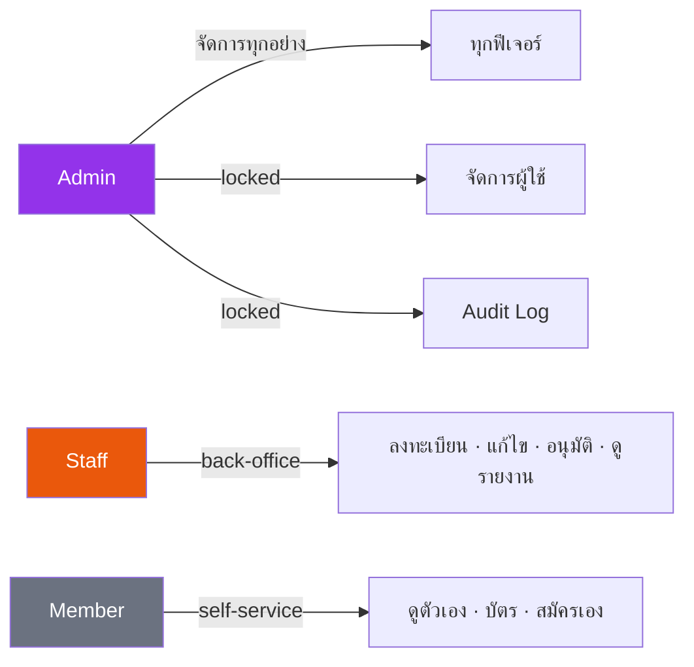
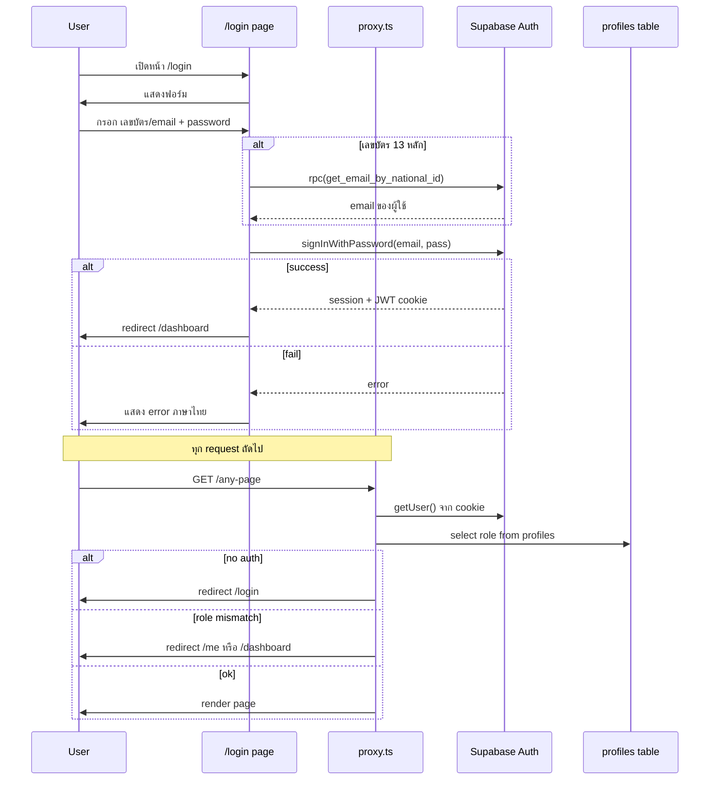
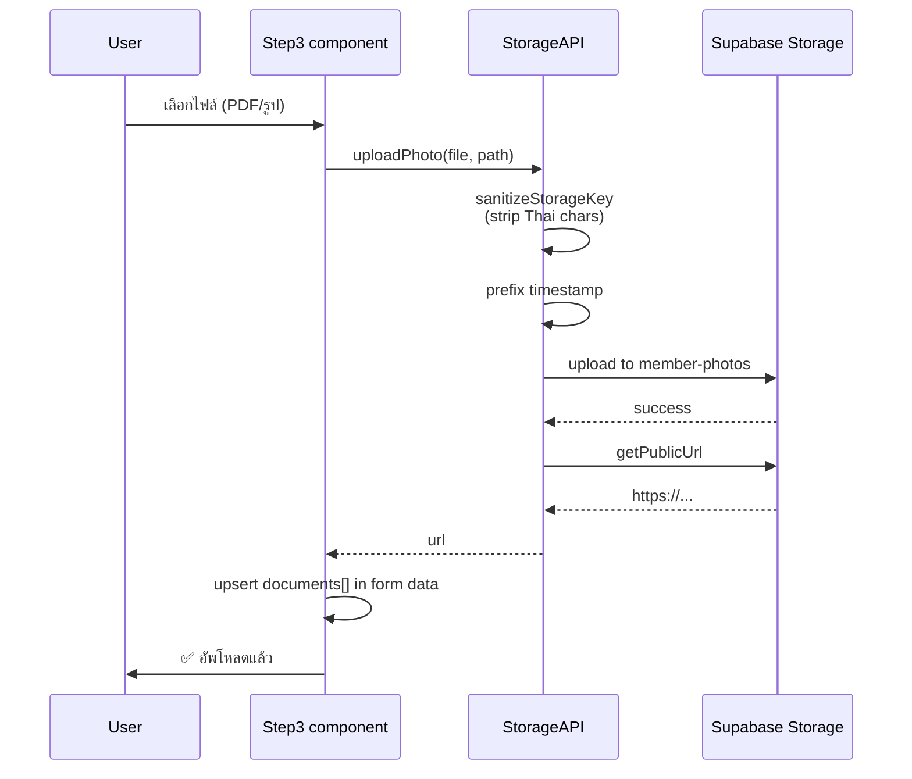
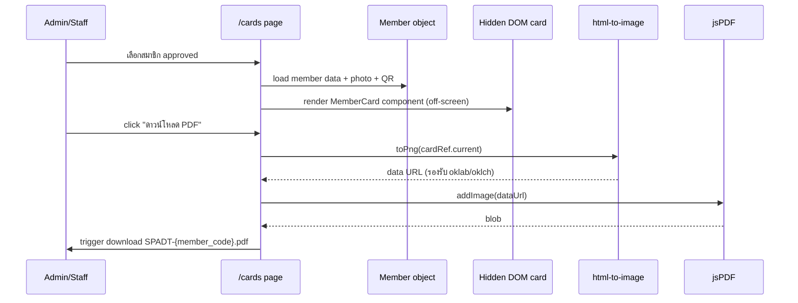
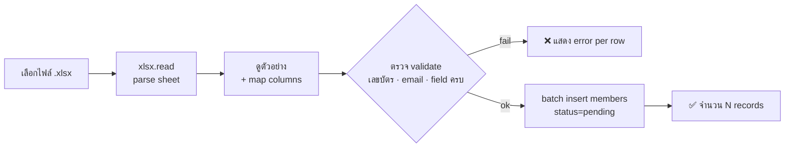
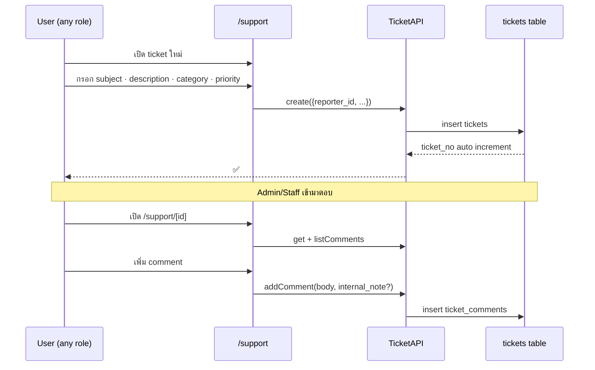
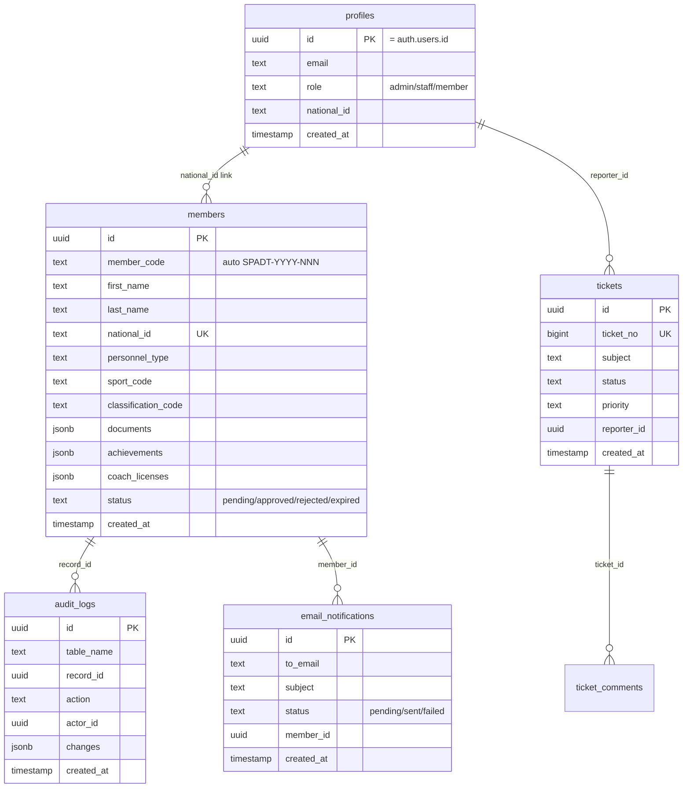
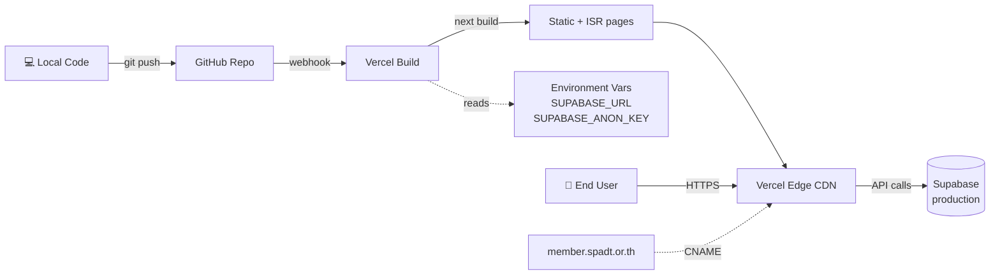
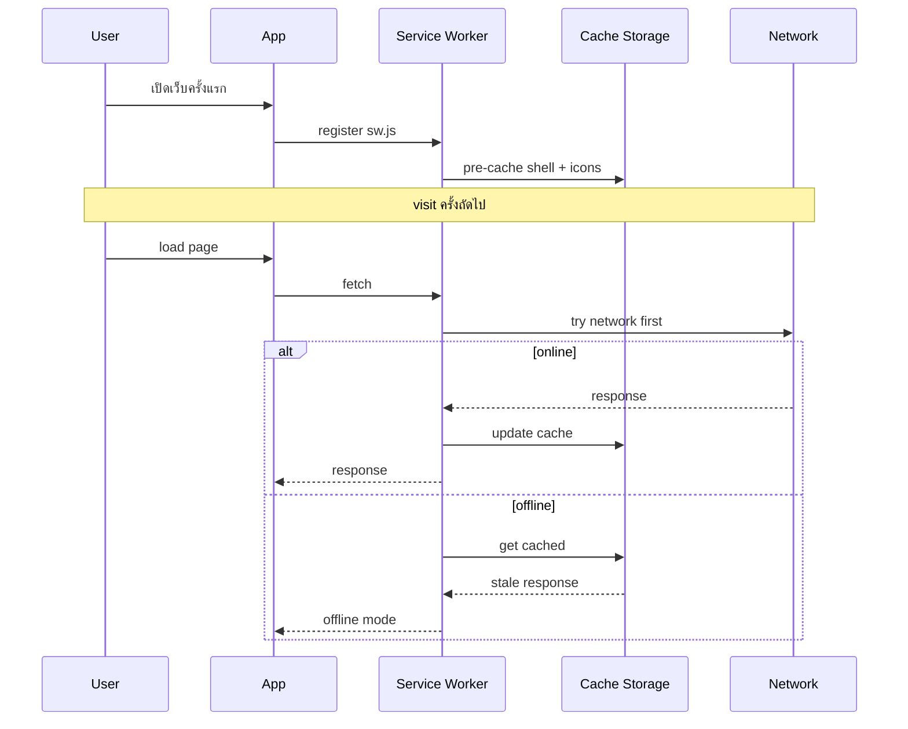
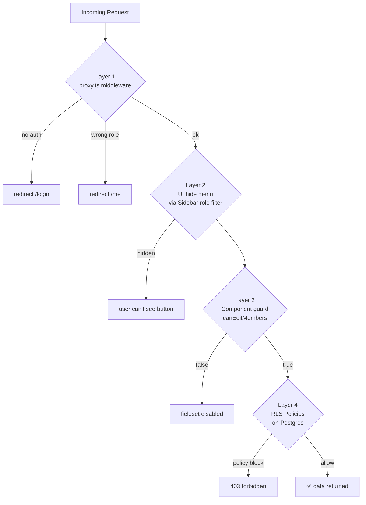

# 🏛️ SPADT Member Management System — System Flow

> สมาคมกีฬาคนพิการแห่งประเทศไทย · Member Management System
> เอกสารนี้รวม Flow การทำงานทั้งหมดของระบบ พร้อม Mermaid diagrams
> ดู diagrams ได้ที่ GitHub, VS Code (Mermaid extension), หรือ markdown viewer

---

## 📐 1. System Architecture

```mermaid
flowchart TB
    User[👤 User Browser<br/>Desktop / Mobile]

    subgraph Frontend["Next.js 16 App Router (Vercel)"]
        Pages[Pages: 23 routes]
        Proxy[proxy.ts<br/>middleware]
        Components[Components: AppShell, Sidebar,<br/>RegistrationForm, MemberCard, ...]
        Lib[lib: auth · api · supabase · constants]
    end

    subgraph Supabase["Supabase Cloud"]
        Auth[(Auth<br/>JWT + Email)]
        DB[(PostgreSQL<br/>+ RLS Policies)]
        Storage[(Storage<br/>member-photos bucket)]
        RPC[RPC Functions<br/>security definer]
    end

    PWA[Service Worker<br/>sw.js + manifest]

    User <-->|HTTPS| Frontend
    User <-.->|cache offline| PWA
    Frontend <-->|@supabase/ssr| Auth
    Frontend <-->|@supabase/supabase-js| DB
    Frontend <-->|getPublicUrl| Storage
    DB <--> RPC
```

**Stack**:
- Next.js 16 + React 19 + Turbopack
- TypeScript + Tailwind v4 (oklab)
- Supabase (PostgreSQL + Auth + Storage)
- PWA ready (offline support)

---

## 👥 2. Role System v3



| ฟีเจอร์ | Admin | Staff | Member |
|---|:---:|:---:|:---:|
| ดูสมาชิกทั้งหมด · แก้ไข · อนุมัติ | ✅ | ✅ | ❌ |
| ลงทะเบียน · นำเข้า Excel · บัตร · รายงาน · ตั้งค่า | ✅ | ✅ | ❌ |
| Email Queue | ✅ | ✅ | ❌ |
| **จัดการผู้ใช้งาน** | ✅ | ❌ | ❌ |
| **Audit Log** | ✅ | ❌ | ❌ |
| สมัคร / กรอก / ส่งใบสมัคร `/register` | ✅ | ✅ | ✅ |
| โปรไฟล์ตัวเอง `/me` | — | — | ✅ |
| บัตรของตัวเอง `/cards` | ✅ | ✅ | ✅ |

---

## 🔐 3. Authentication Flow



**Auth components**:
- `lib/auth.ts` — `signIn`, `signOut`, `getCurrentUser`, role helpers
- `proxy.ts` — middleware route protection
- `lib/supabase.ts` — browser client factory

---

## 📝 4. Member Registration Flow (สำคัญที่สุด)

### 4.1 New User Self-Registration

```mermaid
flowchart TD
    Start([👤 ผู้สมัครใหม่]) --> Signup[/signup<br/>กรอก email + เลขบัตร + password]
    Signup --> Confirm{ยืนยัน email}
    Confirm -->|click magic link| Login[/login?confirmed=1]
    Login --> Register[/register]

    Register --> Step1[Step 1: ข้อมูลส่วนตัว<br/>ชื่อ · เลขบัตร · เกิด · ที่อยู่ · passport · การศึกษา · งาน]
    Step1 -->|validate national_id<br/>RPC check_national_id_exists| Dup{ซ้ำ?}
    Dup -->|yes| BlockDup[❌ block — ใช้เลขบัตรอื่น]
    Dup -->|no| Step2

    Step2[Step 2: ข้อมูลกีฬา<br/>personnel_type · sport · classification ·<br/>team_province · achievements · coach license]
    Step2 --> Step3[Step 3: เอกสาร + ยินยอม<br/>upload 4 ไฟล์ + 3 consent]

    Step3 -->|ติ๊ก consent ครบ + ไฟล์ครบ| Submit[ส่งใบสมัคร]
    Submit -->|insert members<br/>status=pending| DB[(members table)]
    Submit --> Done[✅ ใบสมัครอยู่ใน รออนุมัติ]
```

### 4.2 Document Upload Sub-Flow (Step 3)



**ไฟล์ที่จำเป็น 4 ตัว** (DOCUMENT_TYPES with required=true):
1. สำเนาบัตรประชาชน
2. สำเนาทะเบียนบ้าน
3. ใบรับรองแพทย์
4. รูปถ่าย

---

## ✅ 5. Approval Flow (Admin/Staff)

```mermaid
flowchart LR
    New[📥 ใบสมัครใหม่<br/>status=pending] --> Pending[/pending page]

    Pending --> View[👁 ดูรายละเอียด<br/>/members/id]
    View --> Decision{ตัดสินใจ}

    Decision -->|✅ อนุมัติ| Approve[setStatus approved<br/>+ generate member_code]
    Decision -->|❌ ปฏิเสธ| Reject[setStatus rejected<br/>+ ระบุเหตุผล]
    Decision -->|🛠 แก้ไข| Edit[แก้ไขข้อมูล<br/>+ บันทึก]
    Edit --> View

    Approve --> Card[/cards<br/>ออกบัตรสมาชิก PDF]
    Approve --> Email[email_notifications<br/>queue ส่งแจ้งเตือน]
    Reject --> Email

    Approve --> Audit[(audit_logs<br/>action=APPROVE)]
    Reject --> Audit
    Edit --> Audit
```

**Audit triggers** อยู่ในระดับ DB → ทุก INSERT/UPDATE/DELETE บน `members` ถูก log อัตโนมัติ

---

## 🪪 6. Card Issuance Flow



**ทำไมใช้ `html-to-image` ไม่ใช่ `html2canvas`?**
Tailwind v4 ใช้สี oklab/oklch, html2canvas parse ไม่ได้ → ภาพออกขาว

---

## 📊 7. Reports Flow

```mermaid
flowchart TB
    Reports[/reports<br/>ภาพรวม] --> Stats[stats query<br/>รวมตามสถานะ]
    Reports --> Filter[filter: status / sport / province / search]

    Reports --> Export{Export}
    Export -->|XLSX| ExcelAPI[ExportAPI.membersToExcel<br/>via xlsx lib]
    Export -->|PDF| MemberPDF[/members/id/report<br/>เฉพาะคน — สำหรับสปอนเซอร์/นายจ้าง]

    Advanced[/reports/advanced] --> Charts[Recharts<br/>Pie · Bar · Line]
    Charts --> CrossTab[Cross-tab:<br/>สถานะ × ภูมิภาค × กีฬา]
```

---

## 📥 8. Bulk Import Flow (Excel)



---

## 🆘 9. Support Ticket Flow



---

## 🗄️ 10. Database Schema (Core Tables)



---

## 🌐 11. Page Map (23 Routes)

```mermaid
mindmap
  root((SPADT))
    Public
      /login
      /signup
      /forgot-password
      /reset-password
    Member
      /me
      /register
      /cards
    Staff & Admin
      /dashboard
      /members
        /members/[id]
        /members/[id]/report
      /pending
      /import
      /reports
        /reports/advanced
      /settings
      /admin/notifications
    Admin Only
      /admin/users
      /admin/audit
    Shared
      /classification
      /support
        /support/[id]
```

---

## 🚀 12. Deployment Flow (Vercel)



**Pre-deploy checklist**:
- [ ] Run SQL migrations ใน Supabase production
- [ ] Test register flow end-to-end
- [ ] Test 3 roles เห็นเมนูถูก
- [ ] Test PDF export
- [ ] Test PWA install บน mobile
- [ ] Set Supabase Auth redirect URLs ให้ตรง production domain

---

## 🔄 13. Service Worker / PWA Flow



---

## 🔑 14. Critical Security Layers (Defense in Depth)



**Security definer RPCs** ที่ใช้ bypass RLS อย่างปลอดภัย:
- `my_role_info()` — อ่าน role ของตัวเอง
- `get_email_by_national_id(p_nid)` — login ด้วยเลขบัตร
- `check_national_id_exists(p_nid)` — เช็คซ้ำตอนสมัคร
- `admin_list_users()` — admin ดู user ทั้งหมด
- `admin_update_role(p_user_id, p_role)` — admin เปลี่ยน role (lock เฉพาะ mkongruang@gmail.com)

---

## 📦 15. Key Files Reference

| ไฟล์ | บทบาท |
|---|---|
| `app/page.tsx` | Root → redirect /login |
| `app/login/page.tsx` | Login + magic link confirm |
| `app/signup/page.tsx` | Signup + national_id check |
| `app/register/page.tsx` | 3-step form wrapper |
| `components/RegistrationForm/index.tsx` | Form state + submit logic |
| `components/RegistrationForm/Step1.tsx` | Personal · Address · Passport · Education · Work |
| `components/RegistrationForm/Step2.tsx` | Sport · Classification · Coach license · Achievements |
| `components/RegistrationForm/Step3.tsx` | Documents + Consent + Summary |
| `components/Sidebar.tsx` | Role-based nav filter |
| `components/MemberCard.tsx` | บัตรสมาชิก template |
| `lib/auth.ts` | Auth + role helpers |
| `lib/api.ts` | MemberAPI · TicketAPI · AdminAPI · StorageAPI |
| `lib/constants.ts` | SPORTS · PROVINCES · DOCUMENT_TYPES · ROLE labels |
| `lib/supabase.ts` | Browser client factory |
| `proxy.ts` | Next.js middleware (route guard) |
| `supabase/migration-final-all-in-one.sql` | DB schema + RLS + RPCs |

---

## 📅 Tomorrow's Action Plan

1. **เช้า** — Run SQL migrations ใน Supabase production project
2. **เที่ยง** — Test full E2E (register → approve → card)
3. **บ่าย** — Push GitHub → Connect Vercel → Deploy
4. **เย็น** — Custom domain + Supabase redirect URLs
5. **ค่ำ** — Smoke test on production URL

---

_Generated 2026-04-29 · v3 role system · ready for production_
